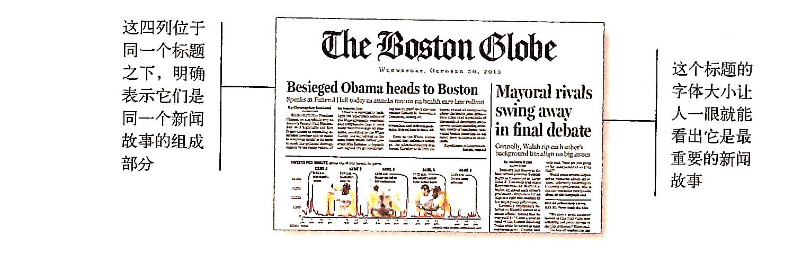

# 广告牌设计101法则 为扫描而设计，不为阅读设计

##1.尽量利用习惯用法
例子：1）停止标识，国内外一致；2）车内的控制装置，刹车在右边； 
web的习惯用法：1）页面上的什么内容在什么位置；2）服务如何运作，如购物流程；3）视觉元素的外观，如关闭按钮；
##2.建立有效的视觉层次

要求：1）越重要的部分越突出；2）逻辑上相关的部分也在视觉上相关；3）逻辑上包含的部分视觉上也包含；

该图片展示一章报纸的布局，使用竖线分割不同内容，标题字体较大，突出且明显，标题下主内容区在标题正下方，读者可以一眼就知道哪些内容是属于哪个标题的。
##3.把页面分成明确定义的区域
因为这可以让用户很快地决定关注页面的哪些区域，或者放心的跳过哪些区域。
##4.明显表示可以点击的地方
因为人们在网络上所做的大多数事情就是找到下一个地方点击，那么明确地标识哪些地方可以点击，哪些地方不能点击，这很重要。
##5.最小化干扰
三种视觉噪声：1）眼花缭乱；2）组织不当；3）太过密集；
解决方案：有罪推论，去除任何对页面没有帮助的内容。
##6.为内容创建清楚的格式，以便扫描
1）充分使用标题；2）保持段落简洁；3）使用符号列表；4）突出关键词；