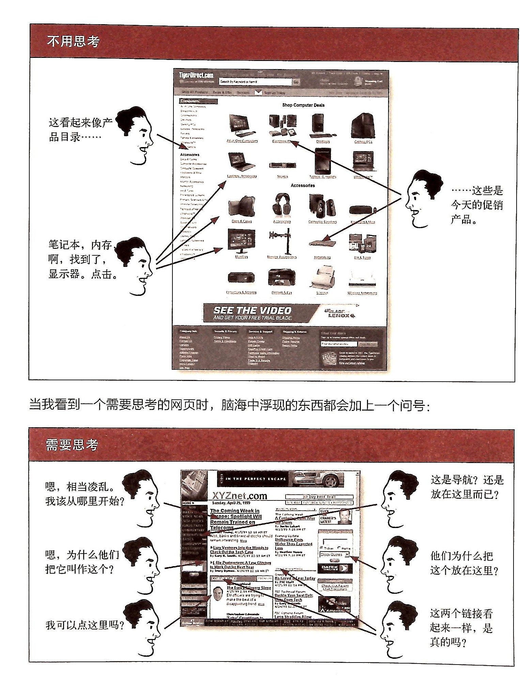
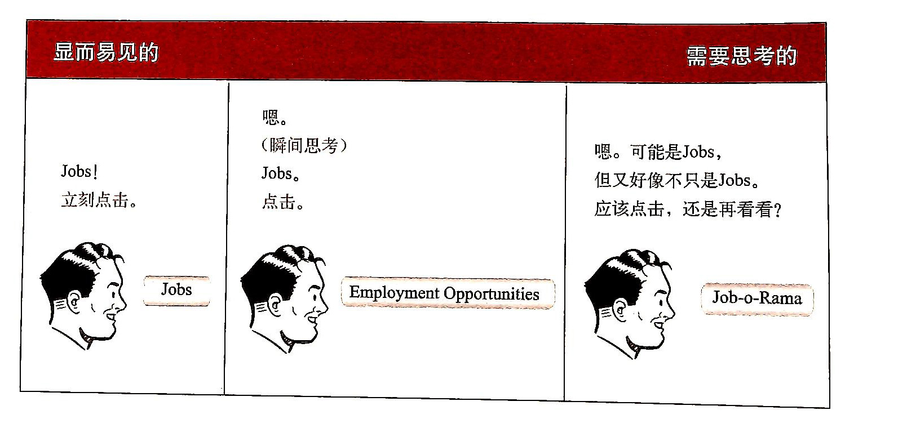
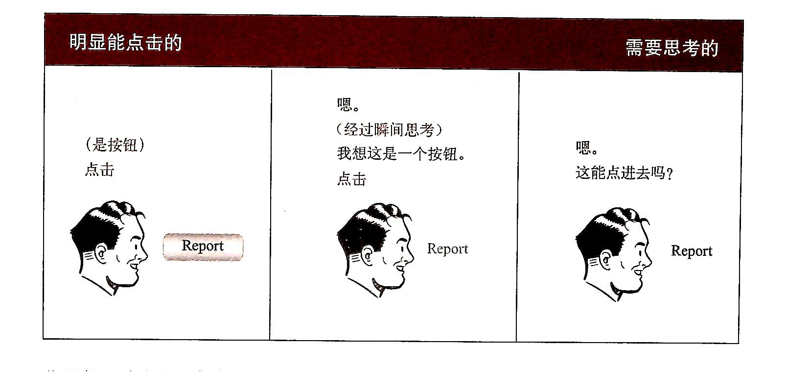
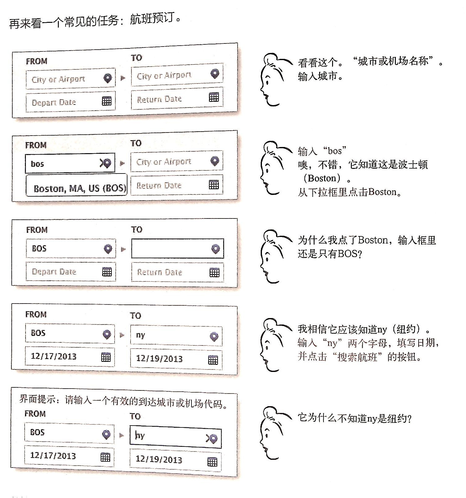
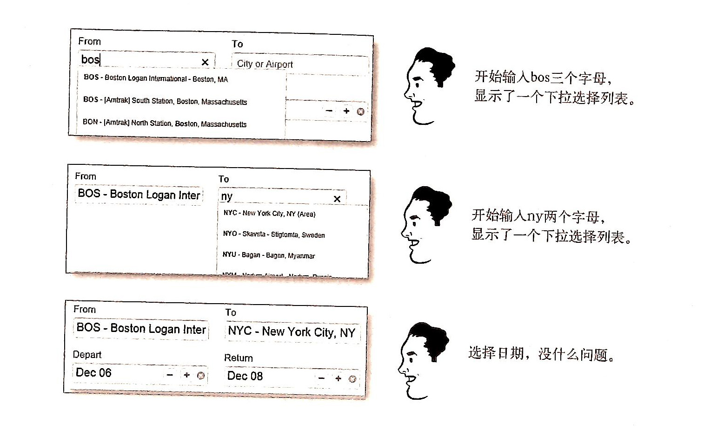

# 别让我思考

如果想保证网站或应用容易使用，那么最重要的是什么？

答案是“别让我思考”

它意味着，设计者应该尽量做到，当用户看到一个页面时，它应该是不言而喻、一目了然、自我解释的。

该图描述了两个网页的视觉效果，第一个网页整体是左右结构，左边是导航栏，右边是商品展示，用户不用思考就能知道哪部分是导航部分，右边是商品展示；第二个网页布局比较复杂，纵向分为四栏，导航区和内容区非常不明显，用户在选择的时候会非常迷惑。

该图片展示了三个按钮，按钮上显示的文本分别为Jobs，Employmet Opportunity，和Job-o-Rama。“Job”我们看到就会知道是和工作职位相关的。“Employmet Opportunity”会觉得可能和工作相关。看到“Job-o-Rama”，就会想到这是什么玩意，需要去猜测才可以。

该图片展示了三个report按钮，第一个有按钮的形状，且字体颜色与背景对比度较高，用户一看就知道是按钮，第二个按钮没有按钮的样式，颜色不同于正文，需要思考下才能知道这是个按钮；第三个按钮与正文相同，用户很怀疑是否能够点击。

该图片展示一个用户在预定航班时遇到的问题，在起始城市输入框输入bos，下拉框显示Boston，但点击却没有进入输入框；到达城市输入ny，不能自动识别出是newYork，用户就会思考为什么不会识别，影响用户的体验。

该图片展示预定航班好的体验，出发城市输入框输入bos，可以识别是波士顿，点击下拉框选项可以进入输入框，输入ny，可以识别是纽约，不需要思考，体验很好。

从我个人角度看，我浏览网页时候，一个网页给我印象好坏，完全在于我找我需要的东西麻不麻烦，如果我进入一个网站，能很快找到我想要的东西，我就认为它是好用的。