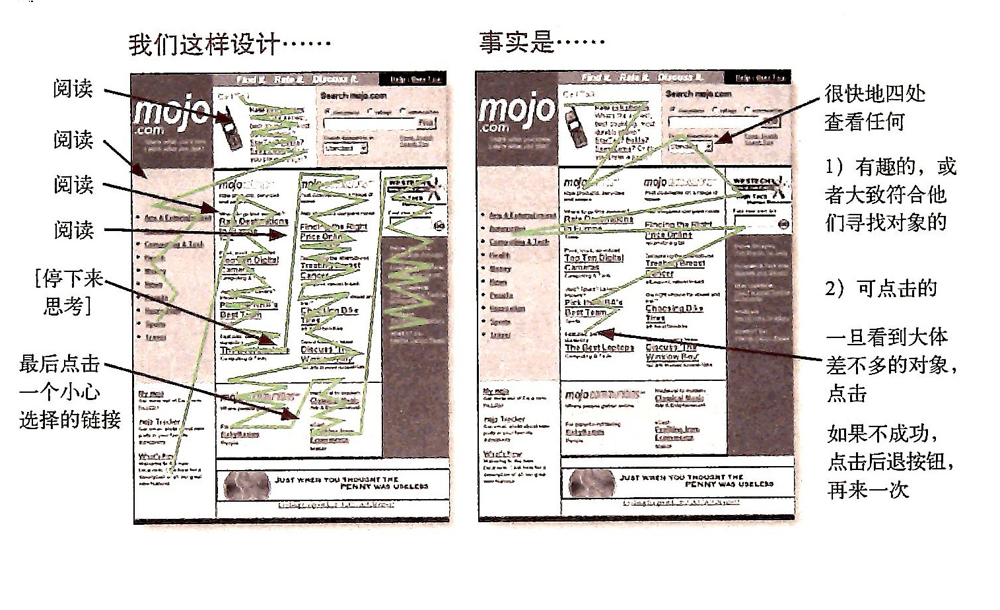
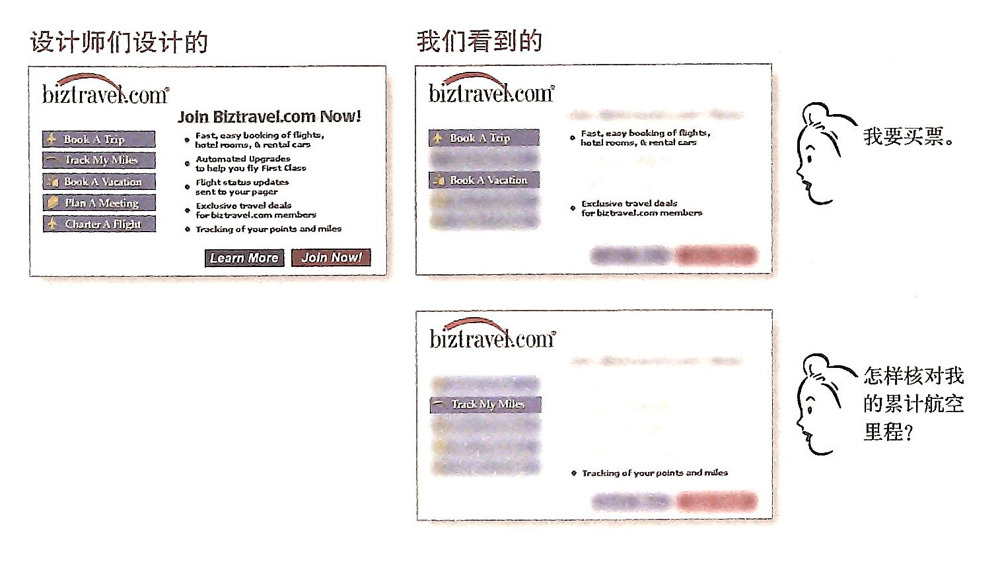

# 我们实际上是如何使用Web的

设计者与使用者的分歧

该图片展示了网页设计者所想的用户浏览方式和用户真实的浏览方式之间的差别。设计者所想的用户的浏览方式为：从上到下、从左到右全部浏览完内容，再选择一个想要的链接；用户的浏览方式为很快地四处查看，找到感性的就点击。

所以设计网页时，要接受用户使用网络的三个事实。

##1.用户不是阅读，是扫描
为什么扫描，1）我们总是任务在身；2）我们知道自己不必阅读所有内容；3）我们善于扫描；

该图片描述了设计师们设计希望用户看到的内容和用户真实看到的内容之间的区别：设计师希望用户能看到页面中的所有内容，用户其实只看到自己感兴趣的内容，比如想要订票，可能只看和“订票”有关的内容。

##2.用户不做最佳选择，而是满意即可

为什么不做最佳选择？1）我们总是处于忙碌中，没有时间对比；2）如果猜错了，也不会产生什么严重的后果，最多是多点击几次返回重新选择；3）对选择进行权衡并不会改善我们的机会，在不好的网站中，权衡没用；4）猜测更有意思。

##3.我们不是追根究底，而是勉强应付

为什么：1）这对我们来说不重要；2）如果发现某个东西，我们会一直使用它。直到我们发现新的更好的替代。