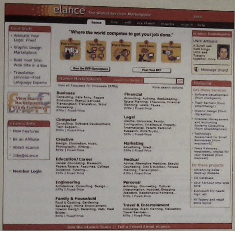
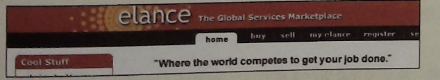
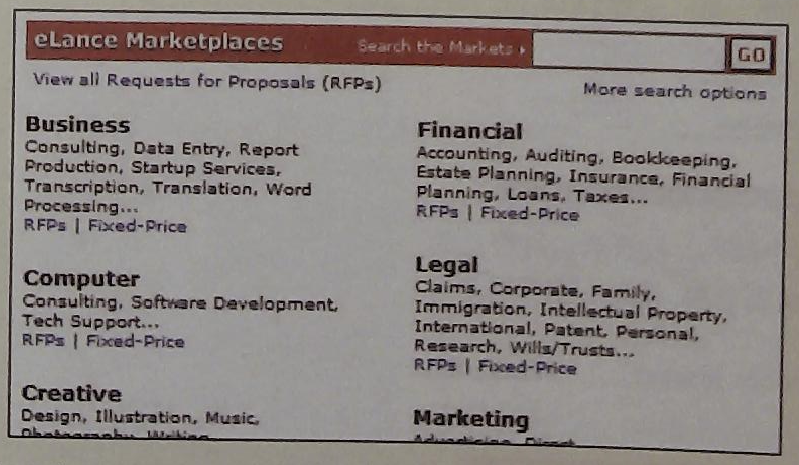
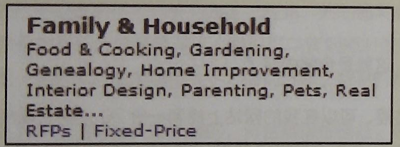

# 一个测试过程实例

下面是一个典型的——不过是虚构的——测试过程摘选，并带有注释。这个网站是真实的，但它现在已经重新设计过了。参加测试的人叫Janice, 25岁左右。

|介绍|--|
|--|--|
| 你好，Janice，我是Steve krug，我会和你一起进行这个测试。在开始之前，我要给你介绍以下，我会一字一句地读给你听，来确定不会遗漏什么信息。 不过还是让我来解释一下为什么今天我们 让你米这1.我们正在测试一个开发中的网站因此想看看真正有人使用它的时候会是什么样子这个过程大槪会花—个小时。 我现在要明确的是，我们在测试这个网站，不是你本人，在这甩你不会犯什么错误，实际上，这是一个你完全没必要担心自己会出错的地方。 我们想知道你是怎么想的，所以请別担心会伤害到我们的感情：我们想要改进这个网站，因此我们想知道你真实的想法。 一会儿我们进行测试的时候，我会请你把心理活动说出来，告诉我们你退怎么想的，这样会对我们有很大帮助。|	我会逐字逐句地把这份我再进行可用性测试时用的“台词”读出来。你可以从 rocketsurgerymadeeasy.com下载一份脚本。|
|如果你有问题，就问好了。我也许不能马上回答这些问题，因为我们想知道没有别人在旁边的时候，人们会怎么做，但是测试结束以后，我会想办法回答任何你还不明白的问题。 如釆在测试过程中你想休息一下，可以告诉我。|	提到这些很重要，因为在进行过程中不回答他们的问题看起来很不礼貌。请在开始之前说淸楚： 1)	这并不是针对他们个人的测试， 也不用担心会伤害其他人的感情; 2)	如果测试结束以后他们还有疑问，你要尽量回答这些问题。|
|你可能注意到了这个麦克风，如果你同意，我们将把计算机屏幕和你所说的话录下来。这些录像只会用来让我们找出改进网站的方法，不会被这个项目之外的人看到。它也会帮到我，因为这样我就不用做笔迹了。 在另一个房间，还有一些Web设计团队的人也在看这个过程 (不过他们看不见我们，只能看见屏幕）。|	这个时候，大部分人都会这么说：“我该不会上到笑笑小电影那样的节目吧？”|
|如果你愿意，可以签一下这份简单的许可声明吗？它只是说我们得到你的许可进行录制，但只会让本项目的相关人员看到这些资料。 你有什么问题吗？  答:不，没有问题了。 |	把豁免和录制许可声明（如果需要）拿给对方签字。 
你同样可以在这里找到这份 声明表格、其他一些有用的文 档和一些检査清单（ checklist): rocketsurgerymadeeasy.com。|

|背景问题|--|
|--|--|
|在我们测试网站之前，我想问你几个问题，第一个问题是：你的职业是什么？也就是你平时的工作？ 答：分单员。 我从来没听说过呢，分单员具体做些什么的呢？ 答：其实没什么，我收取进来的订单，送到合适的办公室去。我们是一个大型跨国公司，所以有很多事情需要安排。 好的。现在，大概说说你每个星期会花多长时间上网，包括浏览和收发邮件。只要大概估计一下就可以了。	|我发现，开始提几个问题来了解一下他们是什么样的人，平时如何使用网络比较好。他们可以松一口气，也会觉得你在认真倾听他们所说的话，而且这些都是无所谓对错的答案。 不要害怕承认你不知道的地方。你的角色不是作为一个专家，而是以为好的倾听者。|
|答：噢，这个我不知道，也许在工作的时候每天四个小时，在家的时候一周八个小时。大部分时间是在周末。晚上太累了。但是有时候喜欢玩一会儿游戏。 收发邮件和浏览网页之间大概是什么比例呢？ 答：嗯，在办公室我大部分时间都花在收发邮件上，我会收到很多电子邮件，其中一大部分是垃圾邮件，但我也得过一遍。我估计 大概用三分之二的时间收发邮件，三分之一的时间上网。 上网的时候大概会浏览哪些类别的网站呢？ 答：上班的时候，绝大部分时间在访问公司的内部网，以及一些竞争对手的网站。在家里，主要是游戏网站和购物类网站。 你有什么特别喜欢的网站吗？ 答：噢，Google，当然，我总是在用它。还有—叫做Snakes.com 的网站，因为我养了一条宠物蛇。|	注意，她不太确定自己花了多少时间上网。大部分人都不淸楚。別担心，在这里答案准 不准确并不重要。这里的关键是让她说话，并想想她是怎样使用网络的，大致估算一下她是哪种用户。|
|真的？是哪种蛇呢？ 答：—条蟒蛇。它现在大约四英尺长，完全长大以后会有八到九英尺那么长。 哇！真好。我们的问题问完了，下面可以开始测试了。 答：好的。|	别怕跑题，可以多了解一下用户，只要你能及时回到主题。|

|主页观光|--|
|--|--|
|首先，我要请你看看这个页面，然后告诉我你认为它是什么：是什么让你这么觉得，你认为这是谁的网站，你能在这里做什么，这个网站是做什么的。就是上下看看，并叙述一下。 你可以滚动屏幕，不过请先不要点击。 |	之前浏览器已经打开了，不过刚才显示的是google，页面上没什么其他可以看的。。 现在我移动鼠标，在一个新的标签页里打开要测试的网站主页，并把鼠标交给参与者。|
| 答：嗯，我想我注意到的第一点是我喜欢这个颜色。我喜欢这种橙色的渐变，也喜欢这个小太阳的图片（就是在页面上端，eLance图标当中）。。 我来看看。（读出来）“The global services market”，“Where the world competes to get your job done ”。  我不知道这是什么意思，完全不明白。 “Animate your logo:”（看着左边的 cool Stuff 栏目）， “Graphic design marketplace”，“View the RFP marketplace” , “eLance marketplaces”。 答：这里有很多东西，但我一个都不明白。	|在一般的测试中，有可能下一个用户会说她讨厌这种橙色渐变，以及图片笔法太单调。不必对这些个人审美反应太过激动。|
|如果你不得不猜一下，那么你认为它会是什么？ 答：嗯，它似乎跟买人卖出……某种东西有关。	 (再次打量页面）当我看到下面这些列表（Yahoo风格的类别列表，在页面的下半部分)，我猜想这可能是一些服务，法律、金融、创意……它们看起来都像是服务。 所以我猜想这是在买入和售出服务，也许像某些在线黄页那样。 好的，现在如果你觉得熟悉了一些，那么会先点击什么呢？ 答：我想我会点击那个图形设计（Graphicdesign)—样的东西，我对图形设计感兴趣。|	这位用户在说出想法方面做得很好。否则，我就该问她了：“你在想什么？”|

|任务测试|--|
|--|--|
|好，现在我们来完成—些具体的测试任务。 还是跟刚才一样，麻烦你尽可能一边操作—边把你的想法说出来，这样会对我们很有帮助。 你可以想想看，有什么你需要的服务，可以让这个网站来帮助你吗？ 答：嗯，让我想想看。我想我在什么地方看见了“ Home Improvement”（家居改善）。我们正打算建一个平台，也许可以在这里找到某个人帮我们完成。 那么如果你打算找人来帮你们建一个平台，你会先做什么？ 答：那么。我得点击….(看着“Home Improvement” (家居改善)，（寻找）在这里，在“Family and Household” （家居）下面。 那么你会怎么做？ 答：那么，我得点击….（看着“ Family and Household”下面的两个链接在犹豫。） 答：嗯，我观在不太肯定怎么办。我不能点击“Home Improvement”， 那么似乎我应该点击“RFPs”或者“Fixed-Price”，但是我不知道这两个有什么区别。Fixed-Price我有点明白，他们会给我—份报价，然后他们会坚持这个价格，但我不太肯定RFPs是什么。|现在我让她执行一项任务，这样我们就能看到她是不是能够按照网站的设计意图来使用。 只要有可能，尽量让用户在选择任务的时候说点什么。 如同它所证明的那样，她弄错了。Fixed-Price在这里指的是每小时固定收费的服务，而 RFPs ( Request for Proposal,招标）才是真正需要报价的。这样的误解常常让建立网站的人非常吃惊。 |
|那么，你觉得你会点击哪个？ 答：Fixed-Price，我想。 点它试试看？|	从这个时候起，我只是看着她试图提交一个项目，让她继续进行，直到1 )她完成了这个任务；2)她完全绝望了； 3)我们在看着她勉强应付的过程中 没有什么新的发现为止。 我会再给她3 ~ 4项任务，这些任务加起来不超过45分钟。|

|问题探查|--|
|--|--|
|现在我们已经完成了测试任务，这里我还有一些问题想问问你。 这些靠近页面顶部的图片怎么样——就是这些有数字的图片？ 你觉得它们是做什么的？ 我注意到了，但我真的不想去弄清楚它们是做什么的。我想它们是在告诉我这个过程中的几个步骤。 为什么你没有多注意一下它们呢？ 答：不，我想我只是还没准备好开始这个过程。我不知道自己是否想要使用它，我只想先到处看看。 0K，好极了。|当参与者在进行测试任务的时候，我会小心翼翼，不提出引导性的问题，因为我不想影响她。 	但我通常会在最后留出一点时间，专门用来询问探查性的问题，这样可以知道到底发生了些什么，是些什么原因。|

在这个例子里，我这么问是因为这个网站的设计者们认为大部分用户都会从点击这五个步骤中的图片开始，至少每个人都会看看它们。

对于我们的DIY可用性测试来说，这就是全部内容了。
如果你想看到一个更完整的测试过程，可以在我的网站上找到一份20分钟的视频，登录rocketsurgerymadeeasy.com，点击“Demo test video”（测试视频样例）就可以了。
