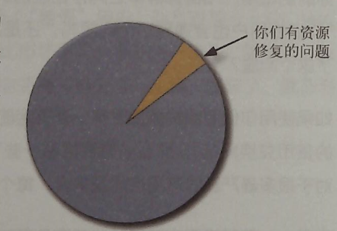

# 应该测试多少用户

**很多情况下，我认为，每轮测试的理想用户数量应该是三个。**

有些人会抗议说三个太少了。他们会说，这么小的样本，根本证明不了什么，也不会发现所有的冋题。这两点都是对的，问题是它们都不重要，因为：

* 
这测试的目的不是为了证明任何东西。要进行证明，就需要定量测试，需要大样本量，一份清楚定义、严格执行的测试计划，收集大量测试数据并进行分析。

DIY测试是一种定性的方法，它的目的是通过发现和修复可用性问题来改进你们正在建造的东西。这个过程一点也不严格：你让他们完成一些任务，你在旁边观察，然后你会了解到很多原来不知道的事实。测试结果是切实可操作的发现，而不是证据。

* 
你不用发现所有的问题。事实上，在进行任何测试的时候，也永远不可能发现所有的问题。而且就算发现了所有的问题，对你也没什么帮助，因为事实如下：

**一个半天的测试，就能让你发现太多的问题。**

你总是会找到太多的问题，而你并没有足够的资源去修复它们，因此，非常重要的是把注意 力集中在首先修复最严重的那些问题上。而且前三个用户，很可能会遇到几乎所有最明显的 那些和当前测试任务相关的问题。

还有，每个月你都会再做一次测试，多做几次测试，远远比写下每次测试中发现的所有问题更重要。

 
图5 几个测试参与者就能帮助你们找到的问题（你们有资源修复的问题很少）。
