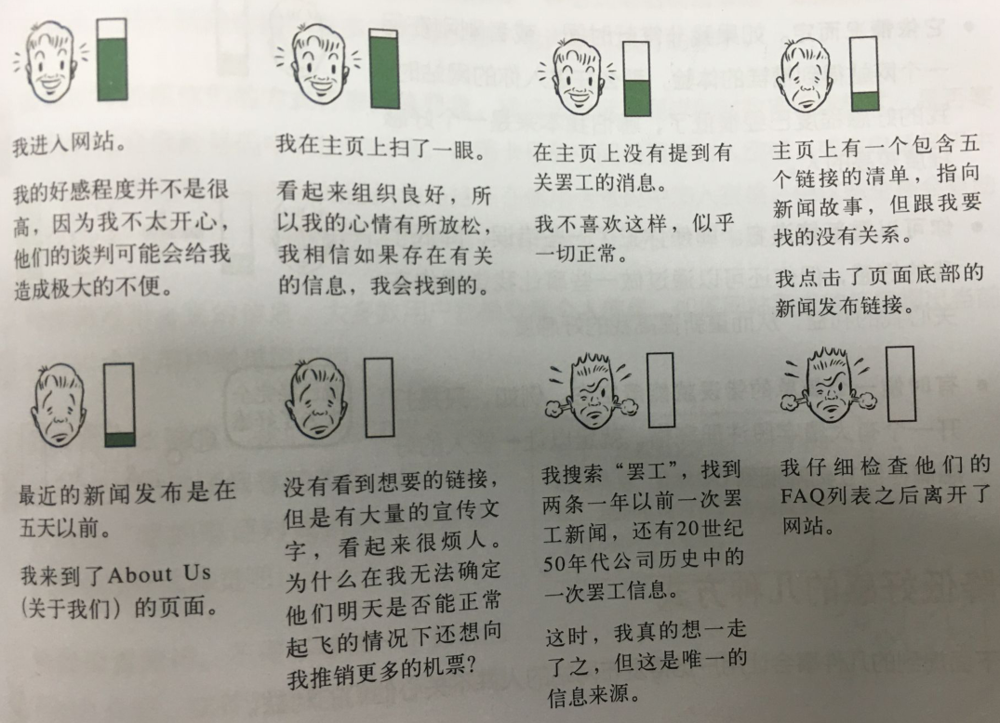

# 可用性是基本礼貌

为什么你的网站应该让人尊敬

##好感存储器

想象每次进入一个网站时，我们都从一个好感储存器开始，在网站上遇到的每个问题会降低好感存储器的高度，例如，我访问某个罢工事件的航空公司网站情形如下：

好感值80%：我进入网站。我的好感程度并不很高，因为我不太开心，罢工者的谈判可能会延误我的航班。

好感值90%：我在主页上扫了一眼。看起来组织良好，所以我的心情有所放松，我相信如果存在有关的信息，我会找到的。

好感值50%：在主页上没有提到有关罢工的消息。我不喜欢这样，似乎一切正常。

好感值30%:主页上有一个包含5个链接的清单，指向新闻故事，但跟我要找的没有关系。我点击了页面底部的新闻发布链接。

好感值20%：最近新闻发布是在5天以前。我来到了关于我们的页面。

好感值0%；没有看到想要的链接，但是有大量的宣传文字，看起来很烦人。为什么在我无法确定他们明天是否能正常起飞的情况下还想向推销更多的机票？

好感值0%：我搜索罢工，找到两条一年以前的一次罢工新闻，还有20世纪50年代公司历史中的一次罢工信息。这时，我真的想一走了之，但这是唯一的信息来源。

好感值0%：我仔细检查他们的问答列表之后离开了网站。

关于这样的好感存储器，有几点值得提一下：

* 它因个人特质的不同而不通；林子大了什么样的鸟都有；要求不同；
* 
它依情况而定；心情本来就好或就不好；
* 
你可以重新填满它；可以犯某些错误，但让我高效完成我要做的事；
* 
有时候一个简单的错误就能清空它。

##降低好感的几种方式

* 隐藏我想要的信息。
* 因为没有按照你们的方式行事而惩罚我；
* 想我询问不必要的信息；
* 敷衍我，欺骗我；
* 给我设置障碍；
* 网站看上去不专业；

##提高好感的几种方式

* 知道人们在你网站上想做什么，并让他们明白简易；
* 告诉我我想知道的；
* 尽量减少步骤；
* 花点心思；
* 知道我可能有哪些疑问，并且给予解答；
* 为我提供协助，例如打印友好页面；
* 容易从错误中恢复；
* 如有不确定，记得道歉；