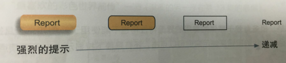
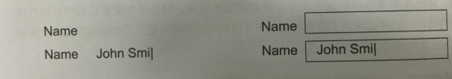

# 移动：不再指示亚拉巴马州的一个城市了

##狭小空间的苛刻

* 设计一个移动版本，把哪些对用户最重要的功能和内容放进去，然后在往上添加新的功能和内容，来创建网站的桌面/完全版。

* 如果想把任何事情都放进去，需要特别注意优先级排序。需要用户立刻完成的或者经常重复的事情应该一眼就能看到，而其他的事情应该轻点几下就能完成，同时也应该有显而易见的路径到达这些地方。

##变色龙的繁育

关于可伸缩的设计。只有两点我能告诉你们的，就是1）非常繁琐，2）难以完善；

没有移动版，现有网站需要：1）允许缩放，2）不要让我站在门口，3）永远记得提供一个全内容网站的链接。

##不要把你的提示藏在后面

图中有四个Report按钮，视觉样式不同，第一个按钮有渐变的背景颜色，有阴影，一看就是可点击的按钮；第二个按钮只有背景颜色和边框；第三个没有背景颜色，只有边框；第四个只有Report字样，完全不知道可不可以点击；

图中有两组姓名输入框，第一组编辑框没有边框，输入的时候只能看到已输入的文字和光标；第二组编辑框有编辑框，输入的时候能看到已输入的文字和光标；

提示需要足够明显；

##没有光标=没有悬停=没有线索

很多赖于悬停的有用的界面特征再也不能使用了，需要找到别的方式来取代。

##扁平化设计：朋友还是敌人

扁平化设计着重干净整洁的外观，上面讲到的是提供充分的视觉信息让用户能察觉到那些提示。

可以尽可能地使用扁平化设计，但请确定还在使用所有余下的线索补偿所失去的那些；

##实际上，可能会太过富余，或者严重不足

响应式设计方案会因为大量的代码和对于用户屏幕来说过大而没必要的图片，不能及时载入页面；

##关于移动应用的可用性属性

让一个有着平均能力和经验的人（甚至稍低于平均水平）能弄明白如何使用它（这说明它是可学习的）去完成某个任务（有效的），而不会遇到不必要的麻烦（高校的）。

1）让人快乐是新的黑马，接近于“当我感觉到的时候我就知道了”，让人快乐的应用通常来自和某个人们希望能实现但是没想过真的能实现的想法的结合，再加上一个明朗的想法，使用某些新技术来完成它。

2)移动应用需要可学习：新功能新特性需要引导学习、使用教程；

3）应用也需要可记忆：比方说照相的时候，为了获取更多视觉空间，会把设置隐藏起来，我们经常找不到怎样找到这些设置，这些就需要记忆。

##移动设备上的可用性测试

移动测试配置：1）主持人和测试参与这观看同一个屏幕；2）屏幕共享软件可以让观察者们看到屏幕上的情况；3）屏幕录制软件会把整个过程录下来；

推荐：1）使用指向屏幕的摄像头而不是镜像技术，可以看到参与者的手势和他们的触点；2）把摄像头连接到移动设备上，让用户能自然地拿着它；3）不要摄像头指向测试参与者。